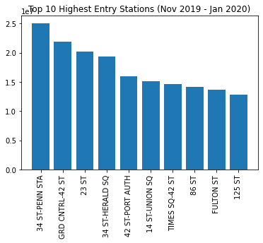
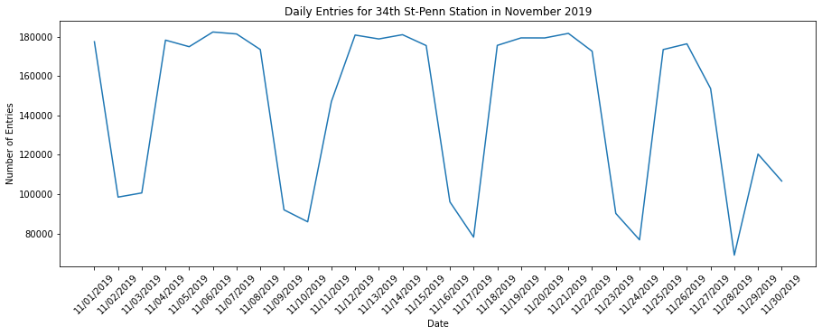

## Analysis of Highest Traffic MTA Stations from November to January

I used a bar chart to visualize the top 10 most visited stations during the period of November 2019 to December 2020.

Because the chart shows that 34th St - Penn Station was the most visited station during the three month period, I dove into the data for November, visualized in the line chart below:

As expected, train entries dip on the weekends, and fall significantly around the Thanksgiving holiday.

These results would help provide suggestions on the days to access this specific station, based on preference of traffic level.
